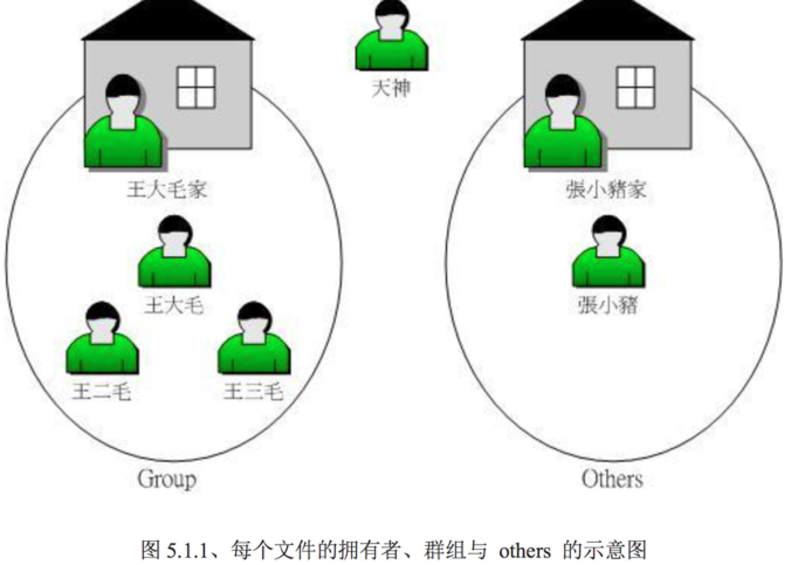
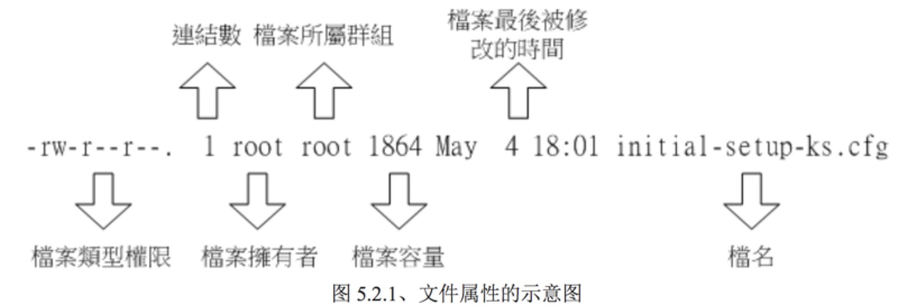
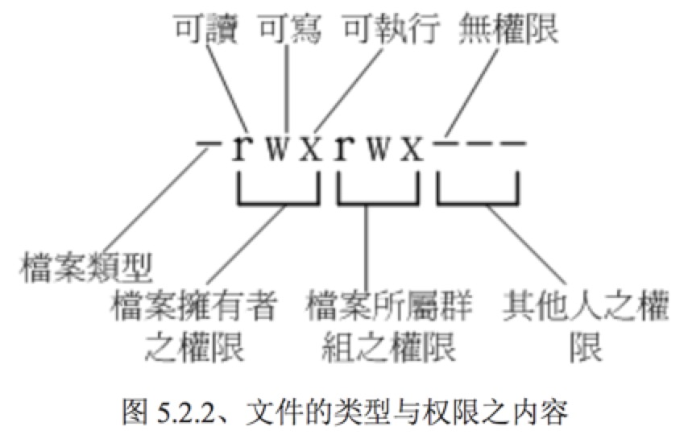

#### 使用者与群组

- 文件拥有者

- 群组

- 其他人

  

#### 文件权限概念

- 文件属性

  

  

  - 档案类型

    | 类型   | 描述                  |
    | ---- | ------------------- |
    | d    | 目录                  |
    | -    | 文件                  |
    | l    | 链结档（link file）      |
    | b    | 装置文件里面的可供存储的接口设备    |
    | c    | 装置文件里面的串行端口设备，如键盘鼠标 |

- 改变文件属性与权限

  - chgrp：改变文件所属群组

    change group的缩写，

  - chown：改变文件拥有者

  - chmod：改变文件的权限，SUID,SGID,SBIT 等特性

- 目录与文件之权限
- 文件种类与扩展名

#### 目录配置

- 目录配置依据
- 目录树
- 绝对路径与相对路径
- centOs观察

